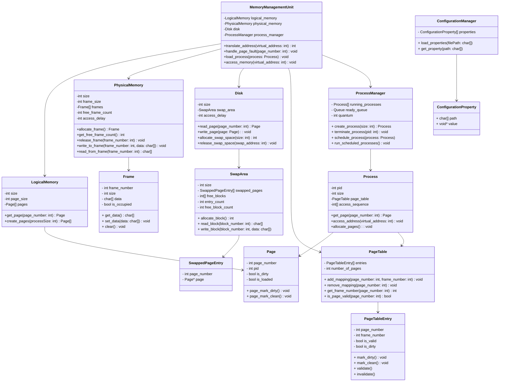

# Operating System Paging Simulation

## Diagramas



### Estrutura `Page`

A estrutura `Page` representa uma página virtual, essencial para o gerenciamento de memória em sistemas operacionais. Ela mantém informações sobre a localização da página na memória, seu estado de modificação e a associação a um processo específico.

1. `page_number` (int):

   Identificador único da página no espaço de endereçamento virtual do processo. Facilita a localização da página durante operações de gerenciamento.

2. `pid` (int):

   Identificador do processo proprietário da página. Permite a distinção entre páginas de diferentes processos.

3. `is_dirty` (bool):

   Indica se a página foi modificada (true) ou não (false). Importante para determinar se a página precisa ser escrita de volta (sincronização) na memória secundária.

4. `is_loaded` (bool):

   Indica se a página está carregada na RAM (true) ou não (false). Facilita a verificação do status de carregamento da página.

5. `mark_dirty()`:

   Marca a página como suja, definindo `is_dirty` como true. Usado quando o conteúdo da página é alterado após ter sido carregado na memória RAM.

6. `mark_clean()`:

   Marca a página como limpa, definindo `is_dirty` como false. Utilizado após a escrita da página de volta ao disco.

### Estrutura `Frame`

A estrutura `Frame` representa um quadro na memória física, onde as páginas dos processos são carregadas. Os quadros são unidades de alocação que permitem ao sistema operacional gerenciar a memória eficientemente, garantindo o acesso rápido às páginas ativas.

1. `frame_number` (int):

   Identificador único do quadro na memória física, utilizado para localizá-lo durante as operações de gerenciamento.

2. `size` (int):

   Tamanho do quadro em bytes, que facilita a alocação e gerenciamento da memória, garantindo um espaço fixo.

3. `data` (char[]):

   Armazena o conteúdo da página carregada no quadro. Alternativa para `byte[]` representando o armazenamento de dados no formato binário.

4. `is_occupied` (bool):

   Indica se o quadro está ocupado por uma página (`true`) ou disponível (`false`). Importante para o gerenciamento de memória.

5. `get_data()`:

   Retorna o conteúdo do quadro, permitindo acesso aos dados da página atualmente carregada.

6. `set_data(data: char[])`:

   Define o conteúdo do quadro, possibilitando carregar ou atualizar a página armazenada.

7. `clear()`:

   Limpa o conteúdo do quadro e define `is_occupied` como `false`, liberando-o para novas páginas e garantindo a integridade dos dados.

### Estrutura `PageTable`

A `PageTable` representa a tabela de páginas de um processo. Ela mantém o mapeamento entre as páginas virtuais e os quadros de memória física, e gerencia as informações relacionadas ao estado de cada página.

1. `entries` (`PageTableEntry[]`):

   Vetor que armazena as entradas de tabela de páginas (`PageTableEntry`). Cada entrada do vetor corresponde a uma página virtual específica e armazena o mapeamento e o estado da página.

2. `number_of_pages` (`int`):

   Representa o número total de páginas que a tabela pode gerenciar, limitando o alcance de `entries` e estabelecendo uma estrutura definida para o mapeamento de memória do processo.

3. `add_mapping(page_number: int, frame_number: int)`:

   Adiciona um mapeamento entre uma página virtual e um quadro físico. Atualiza a entrada da página virtual especificada (`page_number`) com o número do quadro físico (`frame_number`) e marca a entrada como válida.

4. `remove_mapping(page_number: int)`:

   Remove o mapeamento de uma página virtual, invalidando a entrada correspondente. Quando uma página é removida da memória, esse método garante que o sistema não mantenha informações desatualizadas ou incorretas sobre o mapeamento.

5. `get_frame_number(page_number: int) int`:

   Retorna o número do quadro físico associado à página virtual especificada. Lança uma falha de página se a entrada for inválida.

6. `is_page_valid(page_number: int) bool`:

   Verifica se a página virtual especificada está válida (isto é, carregada na memória física). Este método permite que o sistema detecte se a página pode ser acessada ou se é necessário carregar a página (page fault).

### Estrutura `PageTableEntry`

A `PageTableEntry` representa uma entrada individual na tabela de páginas (`PageTable`), armazenando informações sobre o quadro físico, o status de validade e o status de modificação de uma página virtual.

1. `page_number` (int):

   O número da página virtual que esta entrada representa. Este campo age como a "chave" para facilitar a localização do mapeamento associado a uma página específica.

2. `frame_number` (`int`):

   Número do quadro físico onde a página virtual correspondente está carregada. Este campo representa o "valor" para a tradução de endereços virtuais em físicos.

3. `is_valid` (`bool`):

   Flag que indica se a entrada é válida.

   - Um valor `true` indica que a página está carregada na memória física e o mapeamento é válido;
   - Um valor `false` indica que a página está ausente, resultando em uma falha de página quando acessada.

Na literatura, este campo é referenciado como `present`, porém como essa flag não indica apenas se a página está presente na memória física, mas também mostra se o mapeamento entre página e quadro está válido foi decido manter o tempo `valid` para que o página está em um estado válido na memória física e o mapeamento também se encontra válido.

4. `is_dirty` (`bool`):

   Flag que indica se a página foi modificada desde que foi carregada. Um valor `true` significa que a página sofreu alterações e precisa ser gravada no disco se for removida da memória.

   A presença do campo `is_dirty` tanto em `Page` quanto em `PageTableEntry` permite diferenciar o estado de modificação da página em memória virtual (`Page`) e o status de sua última cópia no quadro físico (`PageTableEntry`).

5. `mark_dirty()`:

   Marca a entrada como "suja" (`is_dirty = true`), sinalizando que a página foi modificada. Este método garante que o estado de modificação da página seja refletido corretamente na tabela.

6. `mark_clean()`:

   Marca a entrada como "limpa" (`is_dirty = false`), indicando que a página não possui alterações pendentes.

7. `validate()`:

   Marca a entrada como válida (`is_valid = true`), sinalizando que a página foi carregada na memória física e está disponível para acesso. Este método é chamado durante o carregamento da página.

- `invalidate()`:

  Marca a entrada como inválida (`is_valid = false`), sinalizando que a página foi removida da memória física e que acessos futuros resultarão em falha de página.

### Estrutura `MemoryManagementUnit` (MMU)

A `MemoryManagementUnit` (MMU) é responsável pela tradução de endereços lógicos para endereços físicos, controle de faltas de página e carregamento de processos no simulador de paginação. Essa unidade gerencia as interações entre a memória lógica, memória física e disco, além de coordenar processos e suas requisições de memória.

1. `logical_memory`: 
   
   Armazena as representações de memória lógica do sistema, incluindo as páginas dos processos.
  
2. `physical_memory`: 
   
   Armazena o conteúdo da memória física, composta por frames alocados conforme as necessidades dos processos.

3. `disk`: 
   
   Representa a memória secundária (disco), onde as páginas não carregadas na memória física são mantidas, sendo acessadas em casos de faltas de página.

4. `process_manager`: 
   
   Coordena o controle e o gerenciamento de processos, incluindo o carregamento e a remoção de processos da memória.

5. `translate_address(virtual_address: int) int`: 
   
   Traduz um endereço lógico para seu endereço físico correspondente, utilizando a tabela de páginas para mapear a página lógica a um quadro na memória física.

6. `handle_page_fault(page_number: int)`: 
   
   Gera uma interrupção de falta de página e gerencia o carregamento da página necessária a partir do disco para a memória física. Executa um delay para simular o tempo de acesso à memória secundária.

   Em caso de falta de página (page fault), o processo atual é interrompido para que a MMU possa carregar a página faltante do disco para a memória física, operação que envolve um tempo de acesso mais lento. Como essa transferência é uma operação de I/O, a CPU permanece ociosa durante sua execução. Para otimizar o uso da CPU e evitar períodos de ociosidade, o simulador notifica o process_manager, que escalona o próximo processo na fila de prontos enquanto o carregamento da página ocorre. Dessa forma, a CPU continua em operação, e o processo interrompido é retomado somente quando a página faltante é carregada, garantindo um fluxo de execução mais eficiente.

7. `load_process(process: Process)`: 
   
   Carrega um novo processo na memória lógica e física (inicialização do processo), alocando espaço na memória lógica, mapeando a tabela de páginas para o processo e reservando quadros físicos disponíveis na memória física para acomodar suas páginas.

8. `access_memory(virtual_address: int)`: 
   
   Acessa a memória com um endereço lógico, traduzindo-o para um endereço físico e, em caso de falha, aciona o `handle_page_fault` para recuperação da página.

### Estrutura `LogicalMemory`

A estrutura `LogicalMemory` representa a memória lógica no simulador de paginação, gerenciando o espaço alocado e as operações relacionadas a páginas. A estrutura armazena a configuração básica da memória lógica (como o tamanho total e o tamanho das páginas), e provê métodos para criar e acessar páginas associadas a processos.

1. `int size`:  

   Define o limite de espaço que pode ser utilizado pela memória lógica. Necessário para alocação e cálculo de páginas.

2. `int page_size`:  
   
   Define o tamanho individual das páginas, permitindo calcular o número total de páginas necessárias para armazenar um processo e facilita a divisão de endereços lógicos.

3. `Page[] pages`:  

   Mantém o conjunto de páginas disponíveis, facilitando o acesso e o gerenciamento das páginas ativas na memória lógica.

4. `get_page(page_number: int) Page`:  
   
   Retorna a página correspondente ao número de página fornecido. Permite o acesso direto a uma página específica, necessária para traduzir endereços lógicos e verificar se a página já está carregada.

2. `create_pages(processSize: int) Page[]`:  
   
   Cria e retorna um array de páginas com base no tamanho do processo. Realiza a divisão do processo em páginas, garantindo que cada processo tenha a quantidade de páginas adequada de acordo com seu tamanho e o `page_size` configurado.

### Estrutura `PhysicalMemory`

A estrutura `PhysicalMemory` gerencia a alocação e acesso aos frames da memória física no simulador de paginação, incluindo o controle de frames livres e a aplicação de delays para simulação de acessos. Ela contém métodos para alocar, liberar, e manipular dados nos frames, além de um contador para frames disponíveis.

1. `int size`:  
   
   Especifica o tamanho total da memória física. Define o limite de espaço disponível na memória física para alocação de frames, sendo essencial para calcular o número total de frames possíveis.

2. `int frame_size`:  
   
   Define o tamanho de cada frame da memória física. Determina a granularidade da alocação e permite dividir a memória física em unidades que correspondem aos frames.

3. `Frame[] frames`:  
   
   Mantém o estado de cada frame presentes na memória física, facilitando o acesso e a atualização dos dados armazenados nos frames individuais.

4. `int free_frame_count`:  
   
   Contador de frames livres na memória física. Controla o número de frames disponíveis, auxiliando na gestão de alocação e substituição, e evita tentativas de alocar frames quando não há espaço.

5. `int access_delay`:  
   
   Delay de acesso para simulação de operações com a memória física.

6. `allocate_frame() Frame`:  
   - Aloca um frame livre e retorna uma referência ao frame alocado. Esse processo consiste na busca um frame disponível, reduzindo o `free_frame_count` e atualizando o estado da memória física para acomodar novas páginas.

7. `get_free_frame_count() int`:  
   
   Retorna o número de frames livres. Proporciona ao MMU a situação da memória física, se há espaço suficiente para novas alocações.

8. `release_frame(frame_number: int)`:  
   
   Libera o frame especificado, tornando-o disponível novamente. Ele faz isso atualizando o estado do frame para livre e incrementa `free_frame_count`, permitindo reutilização do frame liberado para novas alocações.

9. `write_to_frame(frame_number: int, data: char[])`:  
   
   Armazena informações no frame designado, incluindo a aplicação de `access_delay` para simulação de tempo de escrita.

10. `read_from_frame(frame_number: int) char[]`:
    
    Recupera dados do frame solicitado, aplicando `access_delay` para simulação de tempo de leitura.

### Estrutura `Disk`

A estrutura `Disk` é projetada para simular o comportamento de uma unidade de disco em um sistema de paginação. Ela permite a leitura e escrita de páginas e a gestão swap para acomodar páginas não alocadas na memória física.

1. `size` (int)  
   
   Representa o tamanho total da área de disco disponível para operações de swap. Esse campo define a capacidade máxima do espaço de swap.

2. `swap_area` (SwapArea)  
   
   Instância da estrutura `SwapArea`, que gerencia o espaço de swap usado para armazenar páginas movidas da memória principal. Contém endereços de página e funções auxiliares para alocar e liberar espaço em disco.

3. `access_delay` (int)  
   
   Tempo de atraso simulado para operações de leitura e escrita no disco, em milissegundos. Este atraso reflete o tempo de acesso mais lento do disco em comparação com a memória principal.


4. `read_page(page_number: int) Page`  
   
   Esse método acessa o disco para localizar e retornar a página especificada pelo parâmetro `page_number`. 
   
   Durante uma falha de página (page fault), quando uma página solicitada por um processo não está na memória física, o simulador busca a página correspondente no disco usando `read_page`. O método localiza a página no espaço de swap, simula o atraso de leitura com `access_delay`, e retorna a instância de `Page` ao chamador para que ela possa ser carregada na memória física.

5. `write_page(page: Page) void`  
   
   O método `write_page` recebe uma instância de `Page` para ser escrita no disco. Esse processo ocorre especificamente quando a página tem a flag `is_dirty = true`, indicando que seus dados foram modificados desde que ela foi carregada na memória física e, portanto, é necessário sincronizar essas alterações com o disco. Isso acontece durante a substituição de páginas, em que uma página precisa ser temporariamente removida da memória principal para liberar espaço para uma nova página.
   
   Isso ocorre em situações de substituição de páginas, onde uma página precisa ser temporariamente removida da memória principal para liberar espaço para uma nova página. 
   
   A função `write_page` armazena a página no espaço de swap, simula o atraso de escrita usando `access_delay`, e registra a operação de substituição, facilitando o rastreamento nos logs.

6. `allocate_swap_space(size: int) int`  
   
   Aloca um bloco de espaço no swap de tamanho especificado pelo parâmetro `size` e retorna o endereço desse espaço. Essa função é acionada quando novas páginas precisam ser movidas para o disco.

7. `release_swap_space(swap_address: int) void`  
   
   Libera o espaço de swap alocado no endereço fornecido, permitindo que o espaço possa ser reutilizado por futuras operações de paginação. Essa função é crucial para evitar fragmentação e esgotamento do espaço de troca.

Claro! Aqui está a documentação da estrutura `SwapArea` em um diagrama de classe utilizando a sintaxe Mermaid, seguida por um detalhamento dos métodos e campos para um documento de especificação técnica.

### Estrutura `SwapArea`

A estrutura `SwapArea` é projetada para gerenciar a área de swap em um simulador de paginação, armazenando informações sobre páginas movidas para a memória secundária.

1. `int size`: 
   
   O tamanho total da área de swap em número de blocos / páginas. Este campo define a capacidade da área de swap.

2. `SwappedPageEntry[] swapped_pages`: 
   
   Um vetor que armazena as entradas de páginas que foram movidas para a área de swap. Cada entrada contém um número de página e um ponteiro para a estrutura da página correspondente.

3. `int[] free_blocks`: 
   
   Um vetor que mantém a lista de blocos livres na área de swap. Esse campo é utilizado para gerenciar a alocação de novos blocos.

4. `int entry_count`: 
   
   Contador do número de entradas atualmente presentes no vetor `swapped_pages`. Facilita a iteração sobre as entradas e o gerenciamento do espaço ocupado.

5. `int free_block_count`: 
   
   Contador do número de blocos livres disponíveis na área de swap. Isso permite uma verificação rápida da disponibilidade de espaço.

6. `allocate_block() int`: 
   
   Aloca um bloco livre na área de swap e retorna o número do bloco alocado. Se não houver blocos disponíveis, é retornado o valor -1, indicando falha na alocação.
  
7. `read_block(block_number: int) Page`: 
   
   Lê os dados de um bloco específico da área de swap identificado pelo `block_number`. 
   
   Retorna uma estrutura Page, representando os dados armazenados no bloco. A escolha de retornar a estrutura `Page` em vez de um array de caracteres ou uma estrutura `Block`, pois como que ambas as estruturas representam informações semelhantes foi decido a fim de facilitar a implementação de simplificar utilizando apenas a estrutura `Page`, porém mantendo a nomenclatura `page` para o contexto de memória virtual e `block` no contexto da area de swap.

8. `write_block(block: Page)`: 
   
   Escreve os dados de uma estrutura `Page` no bloco identificado pelo `block_number`, substituindo quaisquer dados existentes. 
   
   Este método é utilizado para armazenar informações de uma página quando ela é movida da memória para a área de swap. A utilização da estrutura `Page` permite que as operações de escrita se alinhem à representação de dados na memória.

### Estrutura `SwappedPageEntry`

- `int page_number`: O número da página que foi movida para a área de swap. Este campo atua como uma chave para identificar a página armazenada.

- `Page* page`: Um ponteiro para a estrutura da página que foi carregada da memória para o disco. Isso permite que a estrutura acesse diretamente os dados da página.

A seguir, realizaremos uma revisão detalhada da estrutura `Process` no contexto do simulador de paginação em C, seguida de uma explicação sobre cada campo e função, além de um resumo em Markdown com diagrama Mermaid.

### Estrutura `Process`

A estrutura `Process` representa um processo no simulador de paginação, incluindo campos para identificação, gerenciamento de páginas e simulação de acessos à memória. Os métodos associados permitem a tradução de endereços e alocação de páginas, essenciais para o funcionamento eficiente do gerenciamento de memória.

1. `int pid`: 
   
   Identificador único do processo, essencial para o gerenciamento e rastreamento de processos no sistema. Este campo é utilizado para referenciar o processo de maneira única, facilitando a sua identificação durante operações de gerenciamento de memória.

2. `int size`: 
   
   Representa o tamanho total do processo em páginas. Isso determina quantas páginas lógicas o processo pode acessar.

3. `Page[] pages`: 
   
   Um array que armazena as páginas que compõem o processo. Esse campo permite que o processo tenha acesso direto às suas páginas, facilitando operações de leitura e escrita.

4. `PageTable page_table`: 
   
   Estrutura responsável pelo mapeamento das páginas lógicas do processo para frames físicos na memória. Esta tabela é fundamental para a tradução de endereços lógicos em endereços físicos, permitindo que o sistema operacional acesse os dados corretos na memória física.

5. `int[] access_sequence`: 
   
   Um array que simula a sequência de acessos aos endereços de memória pelo processo. Esse campo é útil para testar o comportamento de acesso e a eficiência do gerenciamento de páginas, permitindo simulações de carga e acesso à memória.

6. `get_page(page_number: int) Page`: 
   
   Método que retorna a página correspondente ao número fornecido. Essa função permite que o processo acesse uma página específica, facilitando a manipulação de dados e a execução de operações que dependem de páginas individuais.

7. `access_address(address: int) void`: 
   
   Esta função acessa um endereço de memória específico. 
   
   Durante esse processo, a função deve verificar se a página correspondente ao endereço solicitado está carregada na memória. Se a página não estiver presente, ocorre uma falta de página, e a função deve implementar a lógica necessária para carregar a página da memória secundária, potencialmente resultando em um atraso. 
   
   Essa abordagem garante que, mesmo que um processo tenha suas páginas desalocadas, o acesso à memória seja tratado de maneira eficiente.

8. `allocate_pages() void`: 
   
   Esta função é responsável por alocar as páginas necessárias do processo na memória física. 
   
   Ela deve ser chamada quando o processo entra na fila de pronto para garantir que todas as suas páginas estejam disponíveis antes da execução. 
   
   Essa abordagem minimiza a métrica de tempo de resposta do processo ao reduzir a possibilidade de faltas de página durante a execução do processo. com isso garantindo uma melhor experiência e fluidez para o usuário.

Para ajustar a estrutura do `ProcessManager` e a documentação do projeto para refletir a escolha do algoritmo Round Robin para escalonamento de processos, faremos as seguintes atualizações no diagrama e na documentação.

### Estrutura `ProcessManager`

O `ProcessManager` é responsável pelo gerenciamento e escalonamento dos processos no simulador de paginação. Ele mantém uma lista de processos em execução e uma fila de processos prontos.

O `ProcessManager` gerencia o ciclo de vida dos processos, utilizando um algoritmo Round Robin para escalonamento, assegurando que todos os processos tenham acesso equitativo à CPU. Ele é responsável por criar, executar e terminar processos, garantindo a responsividade do sistema com um baixo tempo de resposta (alinhado com as decisões feitas de alocação de página na estrutura `Process`).

1. `running_processes`: 
  
  Um array que contém todos os processos que estão atualmente em execução. Cada processo possui um identificador único e suas informações associadas.
  
2. `ready_queue`: 
  
  Uma fila que armazena os processos que estão prontos para serem executados. O escalonador retira processos dessa fila para execução.
  
3. `quantum`: 
  
  Um inteiro que define o tempo máximo em nanosegundos que um processo pode usar a CPU em uma única vez antes de ser interrompido. Isso é crucial para o funcionamento do algoritmo Round Robin, garantindo que todos os processos tenham a chance de serem executados de forma equitativa.

4. `create_process(size: int)`: 
  
  Cria um novo processo com o tamanho especificado e o adiciona à fila de prontos.

5. `terminate_process(pid: int)`: 

   Encerra o processo com o identificador fornecido. Remove o processo da lista de processos em execução e da fila de prontos, se aplicável.

6. `schedule_process(process: Process)`: 
  
  Adiciona um processo à fila de prontos para ser escalonado. O escalonador utiliza o algoritmo Round Robin para decidir a ordem de execução dos processos.

7. `run_scheduled_processes()`: 
  
  Executa os processos na fila de prontos usando o algoritmo Round Robin. Cada processo é executado pelo tempo definido no `quantum`. Se um processo não for concluído dentro desse tempo, ele é movido para o final da fila de prontos para que o próximo processo na fila possa ser executado.

## Configuração do simulador

Esta estrutura de configuração proporciona uma maneira flexível e extensível de gerenciar os parâmetros do simulador, permitindo que sejam facilmente carregados a partir de um arquivo e acessados de forma organizada. A classe `ConfigurationManager` facilita o gerenciamento dessas propriedades, promovendo uma configuração mais dinâmica e escalável.

### `ConfigurationProperty`

A classe `ConfigurationProperty` representa uma única propriedade de configuração do simulador. Cada instância dessa classe armazena uma chave e um valor associado, permitindo a flexibilidade de ter diferentes tipos de dados.

- `path`: Uma string que representa o caminho da propriedade no arquivo de configuração (por exemplo, "log.path").
  
- `value`: Um campo de tipo genérico que permite armazenar qualquer tipo de dado (int, float, char[], etc.), representando o valor associado à chave (`path`).

### `ConfigurationManager`

A classe `ConfigurationManager` gerencia um conjunto de `ConfigurationProperty` e é responsável por carregar as configurações a partir de um arquivo e permitir o acesso a essas configurações.

- `properties`: Um array de `ConfigurationProperty` que armazena todas as propriedades de configuração carregadas a partir do arquivo.

- `load_properties(filePath: char[])`: Este método lê o arquivo de propriedades especificado (por exemplo, "simulator.properties") e inicializa o vetor de `ConfigurationProperty` com os parâmetros contidos nesse arquivo.

- `get_property(path: char[])`: Este método recebe uma chave (caminho da propriedade) e retorna o valor associado a essa chave, se ela existir nas propriedades carregadas.

### Exemplo

```properties
# simulator.properties

# Configurações gerais da memória
memory.size=1024
page.size=4
log.path=/tmp/simulator.log

# Delays (em milissegundos)
delay.main_memory=10
delay.secondary_memory=100

# Configurações dos processos
process.1.size=64
process.1.accesses=0,4,8,12,16,20
process.2.size=128
process.2.accesses=0,8,16,24,32,40
```