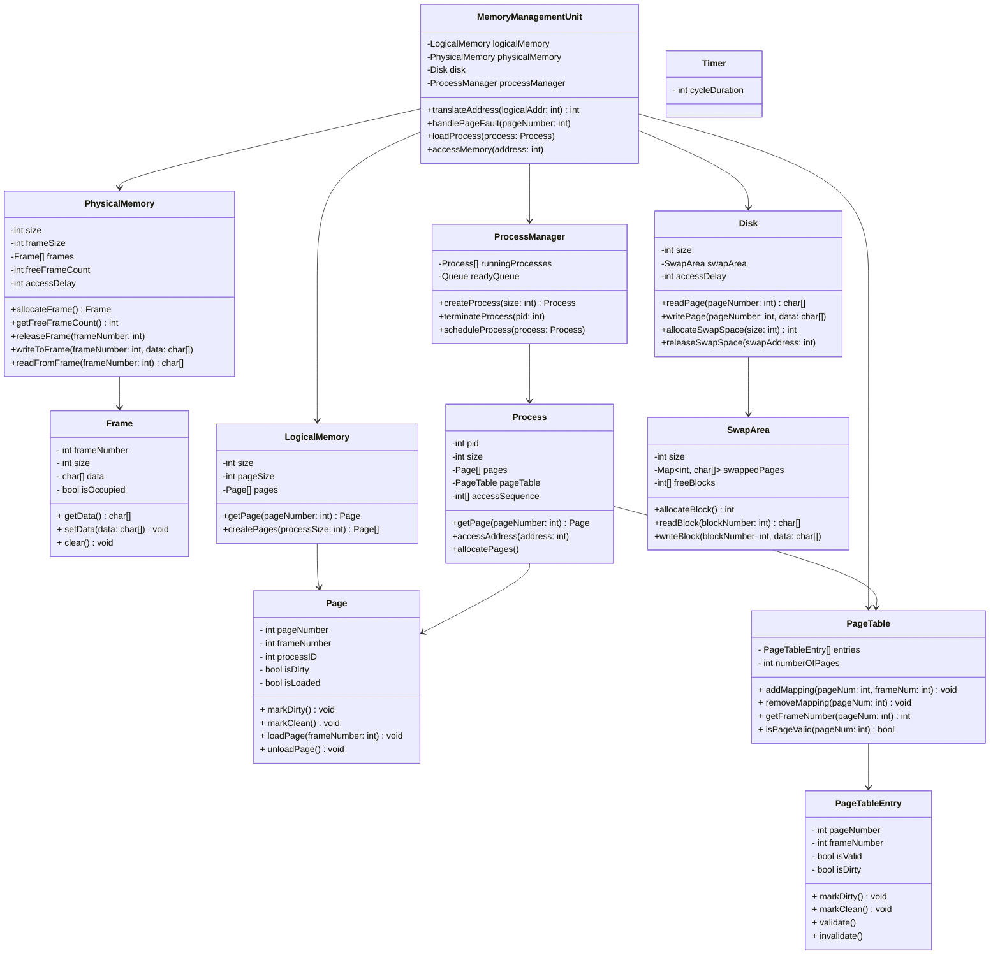

# Operating System Paging Simulation

## Diagramas

### Estrutura `Page`

A estrutura `Page` representa uma página virtual, essencial para o gerenciamento de memória em sistemas operacionais. Ela mantém informações sobre a localização da página na memória, seu estado de modificação e a associação a um processo específico.

1. `pageNumber` (int):

   Identificador único da página no espaço de endereçamento virtual do processo. Facilita a localização da página durante operações de gerenciamento.

2. `frameNumber` (int):

   Número do quadro na memória RAM onde a página está carregada. Um valor de -1 indica que a página não está presente na RAM.

3. `processID` (int):

   Identificador do processo proprietário da página. Permite a distinção entre páginas de diferentes processos.

4. `isDirty` (bool):

   Indica se a página foi modificada (true) ou não (false). Importante para determinar se a página precisa ser escrita de volta (sincronização) na memória secundária.

5. `isLoaded` (bool):

   Indica se a página está carregada na RAM (true) ou não (false). Facilita a verificação do status de carregamento da página.

6. `markDirty()`:

   Marca a página como suja, definindo `isDirty` como true. Usado quando o conteúdo da página é alterado após ter sido carregado na memória RAM.

7. `markClean()`:

   Marca a página como limpa, definindo `isDirty` como false. Utilizado após a escrita da página de volta ao disco.

8. `loadPage(frameNumber: int)`:

   Carrega a página em um quadro de memória específico, atualizando `isLoaded` para `true` e registrando o número do quadro. Necessário para gerenciar o carregamento de páginas na memória.

9. `unloadPage()`:

   Remove a página da RAM, definindo `isLoaded` como false e `frameNumber` como -1. Necessário para a implementação de algoritmos de substituição de páginas (utilizamos o algoritmo FIFO).

### Estrutura `Frame`

A estrutura `Frame` representa um quadro na memória física, onde as páginas dos processos são carregadas. Os quadros são unidades de alocação que permitem ao sistema operacional gerenciar a memória eficientemente, garantindo o acesso rápido às páginas ativas.

1. `frameNumber` (int):

   Identificador único do quadro na memória física, utilizado para localizá-lo durante as operações de gerenciamento.

2. `size` (int):

   Tamanho do quadro em bytes, que facilita a alocação e gerenciamento da memória, garantindo um espaço fixo.

3. `data` (char[]):

   Armazena o conteúdo da página carregada no quadro. Alternativa para `byte[]` representando o armazenamento de dados no formato binário.

4. `isOccupied` (bool):

   Indica se o quadro está ocupado por uma página (`true`) ou disponível (`false`). Importante para o gerenciamento de memória.

5. `getData()`:

   Retorna o conteúdo do quadro, permitindo acesso aos dados da página atualmente carregada.

6. `setData(data: char[])`:

   Define o conteúdo do quadro, possibilitando carregar ou atualizar a página armazenada.

7. `clear()`:

   Limpa o conteúdo do quadro e define `isOccupied` como `false`, liberando-o para novas páginas e garantindo a integridade dos dados.

### Estrutura `PageTable`

A `PageTable` representa a tabela de páginas de um processo. Ela mantém o mapeamento entre as páginas virtuais e os quadros de memória física, e gerencia as informações relacionadas ao estado de cada página.

1. `entries` (`PageTableEntry[]`): 
   
   Vetor que armazena as entradas de tabela de páginas (`PageTableEntry`). Cada entrada do vetor corresponde a uma página virtual específica e armazena o mapeamento e o estado da página.

2. `numberOfPages` (`int`): 
   
   Representa o número total de páginas que a tabela pode gerenciar, limitando o alcance de `entries` e estabelecendo uma estrutura definida para o mapeamento de memória do processo.

3. `addMapping(pageNum: int, frameNum: int)`: 
   
   Adiciona um mapeamento entre uma página virtual e um quadro físico. Atualiza a entrada da página virtual especificada (`pageNum`) com o número do quadro físico (`frameNum`) e marca a entrada como válida.

4. `removeMapping(pageNum: int)`: 
   
   Remove o mapeamento de uma página virtual, invalidando a entrada correspondente. Quando uma página é removida da memória, esse método garante que o sistema não mantenha informações desatualizadas ou incorretas sobre o mapeamento.

5. `getFrameNumber(pageNum: int) int`: 
   
   Retorna o número do quadro físico associado à página virtual especificada. Lança uma falha de página se a entrada for inválida.

6. `isPageValid(pageNum: int) bool`: 
   
   Verifica se a página virtual especificada está válida (isto é, carregada na memória física). Este método permite que o sistema detecte se a página pode ser acessada ou se é necessário carregar a página (page fault).

### Estrutura `PageTableEntry`

A `PageTableEntry` representa uma entrada individual na tabela de páginas (`PageTable`), armazenando informações sobre o quadro físico, o status de validade e o status de modificação de uma página virtual.

1. `pageNumber` (int): 
   
   O número da página virtual que esta entrada representa. Este campo age como a "chave" para facilitar a localização do mapeamento associado a uma página específica.

2. `frameNumber` (`int`):
   
   Número do quadro físico onde a página virtual correspondente está carregada. Este campo representa o "valor" para a tradução de endereços virtuais em físicos.

3. `isValid` (`bool`): 
   
   Flag que indica se a entrada é válida. 
   - Um valor `true` indica que a página está carregada na memória física e o mapeamento é válido; 
   - Um valor `false` indica que a página está ausente, resultando em uma falha de página quando acessada.
  
  Na literatura, este campo é referenciado como `present`, porém como essa flag não indica apenas se a página está **presente** na memória física, mas também mostra se o mapeamento entre página e quadro está **válido** foi decido manter o tempo `valid` para que o página está em um estado válido na memória física e o mapeamento também se encontra válido.

4. `isDirty` (`bool`): 
   
   Flag que indica se a página foi modificada desde que foi carregada. Um valor `true` significa que a página sofreu alterações e precisa ser gravada no disco se for removida da memória.

   A presença do campo `isDirty` tanto em `Page` quanto em `PageTableEntry` permite diferenciar o estado de modificação da página em memória virtual (`Page`) e o status de sua última cópia no quadro físico (`PageTableEntry`).

5. `markDirty()`: 
   
   Marca a entrada como "suja" (`isDirty = true`), sinalizando que a página foi modificada. Este método garante que o estado de modificação da página seja refletido corretamente na tabela.

6. `markClean()`: 
   
   Marca a entrada como "limpa" (`isDirty = false`), indicando que a página não possui alterações pendentes.

7. `validate()`: 
   
   Marca a entrada como válida (`isValid = true`), sinalizando que a página foi carregada na memória física e está disponível para acesso. Este método é chamado durante o carregamento da página.

- `invalidate()`: 
  
  Marca a entrada como inválida (`isValid = false`), sinalizando que a página foi removida da memória física e que acessos futuros resultarão em falha de página.